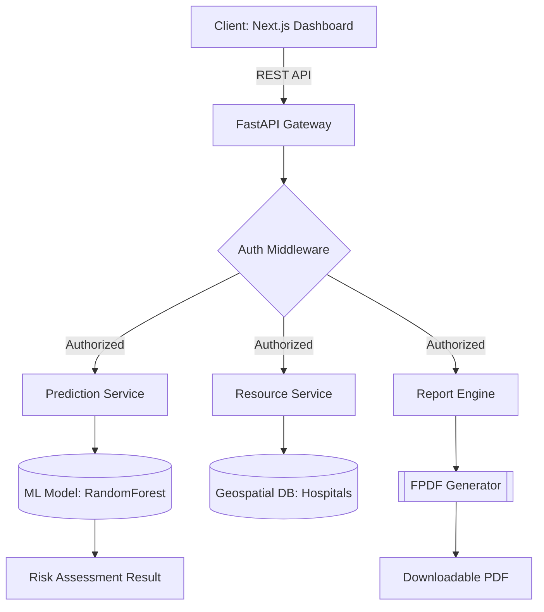

# ❤️ CardioHealth Risk Predictor Pro

[](https://github.com/ruturajbhaskarnawale/CardioVascularRiskPrediction/stargazers)
[](LICENSE)
[](https://nextjs.org/)
[](https://fastapi.tiangolo.com/)

### **AI-Powered Cardiovascular Disease Assessment & Clinical Decision Support System**

**CardioHealth Risk Predictor Pro** is a high-performance clinical tool designed to assist healthcare professionals and individuals in quantifying cardiovascular disease (CVD) risks. By leveraging advanced Machine Learning algorithms trained on thousands of clinical records, the system provides real-time risk scores, personalized health interventions, and automated clinical reporting.

---

## 📸 Visual Preview

| Risk Analysis Dashboard | Bulk Patient Analytics |
| :---: | :---: |
|  |  |

---

## ✨ Key Features

*   **🤖 Intelligent Risk Profiling:** Calculates probability scores across 11 clinical features using fine-tuned **Random Forest** and **Decision Tree** models.
*   **📊 Bulk Data Processing:** Securely process hundreds of patient records via CSV uploads with automated risk tagging and predictive analytics.
*   **📄 Automated Medical Reports:** One-click **PDF generation** featuring precise clinical recommendations, risk visualization, and personalized health factors.
*   **🏥 Healthcare Resource Locator:** Integrated provider search (haversine-based) to connect high-risk patients with specialized care in Maharashtra.
*   **📚 Evidence-Based Education:** A curated content hub for heart-healthy lifestyle management, featuring video integration and clinical articles.
*   **🔐 Modern Security:** Secure authentication layer with hashed credentials and session-based state management.

---

## 🛠 Tech Stack

| Category | Technologies |
| :--- | :--- |
| **Frontend** | **Next.js 16 (App Router)**, React 19, TypeScript, Tailwind CSS, Framer Motion, Recharts |
| **Backend** | **FastAPI**, Python 3.14+, Pydantic, SQLAlchemy, RESTful API |
| **ML/AI** | **Scikit-learn**, Pandas, NumPy, Joblib (Inference Pipeline) |
| **Database** | SQLite (Production-grade relational storage) |
| **Reporting** | FPDF (Vectorized Clinical PDF Generation) |
| **UI Components** | Shadcn UI, Radix UI, Lucide React |

---

## 🧠 System Architecture



---

## 📂 Project Structure

```bash
CardioVascularRiskPrediction/
├── frontend/             # Next.js 16 Application
│   ├── app/              # Router & Page definitions
│   ├── components/       # Radix/Shadcn UI Library
│   └── lib/              # API Clients & Validation logic
├── backend/              # FastAPI Python Service
│   ├── app/              # Core Application Logic
│   │   ├── routers/      # Modular REST Endpoints
│   │   ├── services/     # Prediction & PDF Business Logic
│   │   └── models/       # Pydantic Schemas
│   ├── data/             # Datasets & SQLite Store
│   └── models/           # Serialized Scikit-Learn pipelines
├── assets/               # Visual media & Branding
├── legacy/               # Original Streamlit R&D Phase
└── start_project.bat     # Windows Orchestration Script
```

---

## ⚙️ Installation & Setup

### **Quick Start (One-Click)**
Launch the entire ecosystem with a single command on Windows:
```bash
./start_project.bat
```

### **Manual Configuration**

**1. Backend (FastAPI)**
```bash
cd backend
python -m venv venv
venv\Scripts\activate
pip install -r requirements.txt
uvicorn app.main:app --reload
```

**2. Frontend (Next.js)**
```bash
cd frontend
npm install
npm run dev
```

---

## 📈 Engineering Excellence

*   **Inference Pipeline Stability:** Implements fixed-version scaling (MinMaxScaler) to ensure parity between R&D and Production environments.
*   **Asynchronous Scalability:** Backend utilizes non-blocking I/O for file processing and bulk report generation.
*   **Atomic Component Architecture:** UI follows a scalable design system for high maintainability and consistent UX.
*   **Type Safety:** End-to-end type validation from backend Pydantic models to frontend TypeScript interfaces.

---

## 👨‍💻 Author

**Ruturaj Bhaskar Nawale**
*   **GitHub:** [@ruturajbhaskarnawale](https://github.com/ruturajbhaskarnawale)
*   **LinkedIn:** [linkedin.com/in/ruturaj-nawale](https://linkedin.com/in/ruturaj-nawale)
*   **Portfolio:** [ruturajnawale.dev](https://ruturajnawale.dev) (Placeholder)

---

## ⭐ Support & Contributions

Contributions are welcome! If you find this project valuable for clinical research or engineering study, please give it a **star**!

1. Fork the Project
2. Create your Feature Branch (`git checkout -b feature/AmazingFeature`)
3. Commit your Changes (`git commit -m 'Add some AmazingFeature'`)
4. Push to the Branch (`git push origin feature/AmazingFeature`)
5. Open a Pull Request
'`)
4. Push to the Branch (`git push origin feature/AmazingFeature`)
5. Open a Pull Request

**If you find this project valuable, please give it a ⭐ on GitHub!**
